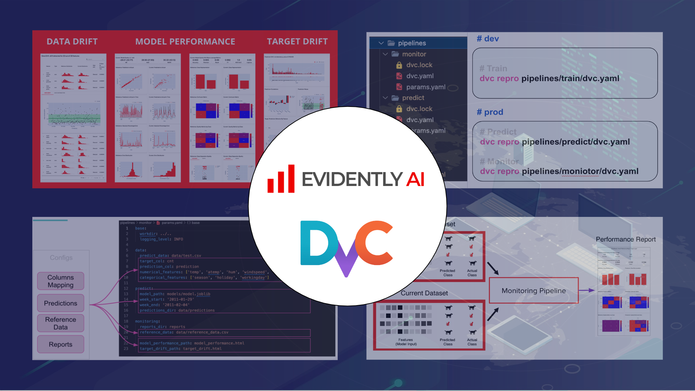

# Tutorial: Build Data validation and Model Monitoring pipelines with DVC and Evidently


## Create virtual environment

Create virtual environment named `.venv` and install python libraries
```bash
python3 -m venv .venv
echo "export PYTHONPATH=$PWD" >> .venv/bin/activate
source .venv/bin/activate
pip install --upgrade pip setuptools wheel
pip install -r requirements.txt
```

## Run pipelines

### `train`

```bash
dvc repro pipelines/train/dvc.yaml
```

### `predict`

```bash
dvc repro pipelines/predict/dvc.yaml
```

### `monitor`

```bash
dvc repro pipelines/monitor/dvc.yaml
```


### View reports

Enter directory `reports/`, open required period folder and launch HTML report in a browser.
